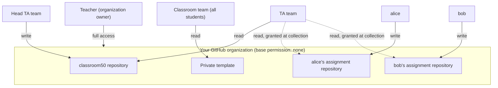

# How Classroom 50 Works

This page describes the model behind Classroom 50 — what it is, where its data
is stored, and why teachers remain involved in administration. It also explains
behavior that is otherwise surprising, such as why a student is an admin of
their repository, or why unenrolling a student does not delete their repository.

## The mental model: GitHub is the backend

Many web tools have a server and a database: you sign in to their account, and
their systems store your data. Classroom 50 does not work this way.

- The **web app** ([classroom50.org](https://classroom50.org)) is a static site
  hosted on GitHub Pages. It runs in your browser.
- The **CLI** (`gh teacher` / `gh student`) runs on your own machine.

Neither keeps a database of classroom data. The web app stores only a small
amount of local state in your browser — your GitHub access token and interface
preferences such as theme and language — and the CLI reuses the GitHub CLI's
stored credentials. Everything else is stored in GitHub, and your classroom's
state is represented by ordinary GitHub data:

| What you think of as… | Is stored as… |
| --- | --- |
| Your classrooms, assignments, scores | Config files in a private `classroom50` repo in your org |
| Who's enrolled | GitHub organization and team membership |
| Who's staff (teacher/TA) | Membership in `secret` GitHub teams |
| An address you invited, before that person joins | A `secret` per-invite team, deleted once they accept |
| A student's submissions | Commit history and Releases in their repo |
| Who can do what | GitHub permissions |

Classroom 50 reads and writes this GitHub data on your behalf, then reads it
back to show the current state. Most of the behavior described below follows
from this.

## Why teachers stay involved

Because there is no always-on server, the app does not change state on its own
while you are signed out. It cannot sync state in the background the way a
hosted service can. As a result:

- **Interactive work runs as you.** Creating a classroom, adding a student,
  saving an assignment, or inviting a TA runs at the moment you do it, using
  your signed-in GitHub token. These changes happen only when you make them.
- **Signing in can trigger a sync.** Opening a classroom lets the app
  correct things that have fallen out of date — for example, migrating an old
  team name or re-checking organization settings. Some upkeep occurs only
  after an owner signs in and loads the page.
- **Background jobs require setup.** Score collection and regrading run as
  GitHub Actions on a schedule, but only after you provision the
  [service token](#the-service-token) that lets them act while you are offline.

For teachers, this means administering Classroom 50 is closer to administering
your own GitHub organization than to using a hosted service.

### When state refreshes

Because state lives on GitHub, "what you see" depends on when something last
read it:

- **Web app** — loading a page reads the current GitHub state (so opening
  classroom50.org effectively refreshes the roster, teams, and config), and
  signing in as an owner can additionally run sync upkeep. One
  exception: the **organization list** is cached for ten minutes — use
  **Refresh** to force it. If a view looks out of date, reopening the page
  usually updates it.
- **CLI reads** (`roster list`, `classroom list`, `member list`, …) report
  what's committed and on GitHub **at that moment**; they never write or
  sync. If the web app shows a newer roster than `roster list` did a
  minute earlier, someone (or a sign-in sync) committed in between.
- **CLI writes** (`roster add`, `staff add`, `assignment add`, …) update the
  `classroom50` repository and GitHub teams immediately, but only for the thing they
  change — they don't run the web app's broader sync.
- **Scores** refresh only when collection runs: nightly, or on demand with
  **Sync now** / `collect-scores.yaml`.

There is no separate force-sync command. Opening the classroom in the web app
while signed in as an owner is the closest equivalent, and **Sync now** covers
scores.

## Interactive vs. background work

Work happens in one of two ways. Knowing which applies explains most questions
about why a change did or did not take effect:

1. **Interactive actions** run as you, with your signed-in GitHub token, at the
   time you take them (create a classroom, add a student, accept an assignment).
   They are limited by your GitHub permissions and require you to be present.
2. **Asynchronous actions** run in **GitHub Actions workflows** in your
   `classroom50` repository (publishing to Pages, collecting scores,
   regrading). They run in the background, can take a minute or more, and
   depend on the
   [service token](#the-service-token) rather than on you being online.

So when a change "hasn't shown up yet," it's usually a background workflow still
running (or GitHub Pages still deploying), not a lost action.

## The web app and CLI are equivalent

The web app and the `gh teacher` / `gh student` CLIs are two front ends over the
same GitHub operations; neither is primary. A classroom created in the web app
is fully manageable from the CLI and vice versa, because both read and write the
same files and teams in your organization. Use whichever you prefer, or mix
them.

## Roles are GitHub organization roles and teams

Classroom 50 has four roles, and each maps directly onto a GitHub construct:

| Role | On GitHub | Can |
| --- | --- | --- |
| **Teacher** | Organization **owner**, on the `-teacher` team | Everything, including org + classroom settings |
| **Head TA** | Org **member**, on the `-hta` team | Write the `classroom50` repository; manage the classroom; not an owner |
| **TA** | Org **member**, on the `-ta` team | Read the `classroom50` repository; view submissions |
| **Student** | Org **member**, on the classroom team | Accept and submit assignments |

Every classroom has a set of `secret` GitHub teams
(`classroom50-<classroom>-{teacher,hta,ta}` plus the student team
`classroom50-<classroom>`). Membership in these teams *is* the role — there's no
separate role database. That's why staff you invite show up as GitHub team
invitations, and why the classroom's **team is the source of truth for who's
enrolled** (not the `roster.csv`, which carries details GitHub can't store,
such as names, sections, and the address of a student who hasn't joined yet).

### From invitation to enrollment

Enrollment is team membership, and the chain from invitation to enrollment has
three steps:

1. Creating a classroom creates its secret GitHub teams, including the student
   team `classroom50-<classroom>`.
2. Inviting a student through Classroom 50 sends a GitHub organization
   invitation that carries the classroom team.
3. When the student accepts, GitHub adds them to the organization **and** the
   team in one step. Team membership makes them enrolled.

Because the invitation carries the team, inviting a student directly on
github.com bypasses enrollment: they become an organization member but never
join the classroom team. Enroll them from the organization's Members page
instead. See
[Already an org member, but not on the roster](Troubleshooting#already-an-org-member-but-not-on-the-roster).

### Invitations by email

Inviting by username records the student on the roster right away, because the
username is the identity. An email address is not: GitHub offers no way to look
up an account from an address, and the person who accepts could sign in with any
account. Classroom 50 bridges that gap with an **invite team**.

1. Inviting an address creates a `secret` team named `invite-<hash>` that holds
   that one address, and writes the address to `roster.csv` as a **pending row**
   with no username yet.
2. The invitation carries both the classroom team and the invite team.
3. Accepting adds the student to both. Because the invite team holds exactly one
   person, whoever is on it is the student who accepted, so the next roster sync
   fills their account into the pending row and deletes the invite team.

An invitation nobody accepts leaves nothing behind. Cancelling one deletes its
invite team at once, and the pending row goes away on the next roster sync. An
invitation that expires on GitHub's side is cleaned up the same way, once the
team is more than 24 hours old; a still-pending invitation is never touched,
however long it stays outstanding. To clear stored addresses early, use
**Clean up invite data** on the classroom's **Settings** page; deleting a
classroom removes its invite teams too.

> [!NOTE]
> Invite teams are the one place Classroom 50 stores an address that GitHub
> hasn't yet linked to an account. Each holds only the invited address and the
> classroom name, never names or sections, and `secret` teams are readable only
> by organization owners, so students and TAs can't see them. The address on a
> pending row is the one **you invited**, which is not necessarily the email on
> the student's GitHub account.

### Who sees what

The org lockdown (next section) means nobody sees anything they weren't
explicitly granted. What each role can see:

| | Teacher (owner) | Head TA | TA | Student |
| --- | --- | --- | --- | --- |
| `classroom50` repository (roster, scores, settings) | Read and write | Read and write | Read | No access |
| Private assignment templates | All | Read | Read | Read (their classroom's) |
| Student assignment repositories | All | Read, granted at each collection run | Read, granted at each collection run | Their own only (write) |
| Other students' work | All | After a collection run | After a collection run | Never |
| Pending organization invitations | Yes | No | No | No |



Three consequences worth calling out:

- **Students never see each other's work.** The "No permission" base grants
  nothing by default, and nothing grants one student access to another's
  repository.
- **Students can read their classroom's private templates.** The whole
  classroom team gets read access so accept can copy the template. Never
  commit solutions to a template. See
  [Known limitations](Known-Limitations).
- **Only owners can read pending invitations.** A TA viewing the roster can't
  see who has been invited but hasn't accepted yet, so an invited-but-pending
  student may look missing to them.

## The permission model: why students are admins

The organization is locked down to **least privilege**. During setup, Classroom
50 sets the org's base permission to **"No permission"** and disables risky
member capabilities (repo deletion, transfer, visibility changes, and more).
This org-wide lockdown is the safety boundary.

Against that backdrop, each student's access to *their own* assignment
repository is deliberately broad:

- **Individual assignments:** the student is created as an admin of their repo,
  then downgraded to **write**, enough to push work but not enough to do damage.
- **Group assignments:** the first student to accept (the **founder**) keeps
  **admin** on the shared repo, because they need it to invite teammates as
  collaborators. Classroom 50 has no separate "create a team" step — students
  form their own groups.

This is safe **because of** the org lockdown: even an admin on their own repo
can't delete it, change its visibility, transfer it, or reach another student's
private repo (the "No permission" base blocks cross-repo access). The generous
per-repo access and the strict org policy work together.

> [!NOTE]
> TAs and head TAs get read access to student repositories through the
> score-collection workflow, not at accept time. A newly accepted repo
> therefore has no staff team attached to it, which is expected.

## How student repositories are protected

Setup applies two organization-wide rulesets to every repository in the
organization:

- **`classroom50-protect-submission-history`** targets each repository's
  default branch and blocks force pushes and branch deletion, so a student
  can't rewrite or erase their submission history.
- **`classroom50-feedback-base-lock`** targets the `feedback` branch and blocks
  updates and deletion, keeping the frozen base of the
  [Feedback pull request](Autograding-Basics#feedback-pull-requests) in place.

Both rulesets include an organization-admin bypass, so teachers keep full
control. Separately, the `classroom50` repository's `main` branch has classic
branch protection with force pushes and deletion disabled.

If the setup checks report branch protection as failing and **Fix it** doesn't
resolve it, an enterprise-level policy is usually pinning the setting. The
check is advisory: Classroom 50 works without it. See
[Branch protection "Fix it" does nothing](Troubleshooting#branch-protection-fix-it-does-nothing).

## Why organization settings sometimes change back

If you run both Classroom 50 and GitHub Classroom in the same organization, they
can disagree on a setting and flip it back and forth, most notably private-repo
forking. That tug-of-war shows up in the setup and audit checks as settings that
changed outside Classroom 50.
Classroom 50 no longer enforces the forking setting for this reason; private
templates work either way. If you see a setting you fixed revert later, another
tool (or an org/enterprise policy) is changing it back.

## How grading flows

1. A student pushes to their repository (via `gh student submit` or a plain
   `git push`).
2. A small workflow in their repo calls the shared **autograde runner** in your
   `classroom50` repository, which fetches the grading logic from Pages and runs it.
3. The result is published as a **GitHub Release** on the student's repo.
4. The **score-collection** workflow gathers those results into `scores.json`.

Autograding is optional — an assignment with no tests still tags submissions and
supports feedback. See [Autograding Basics](Autograding-Basics) for the full pipeline.

### The Feedback PR opens at accept, with the diff starting at the baseline

If you enable the Feedback pull request, it is opened when the student accepts,
so it is waiting before their first submission — and it exists even when GitHub
Actions is disabled for student repos. Its base is frozen at the accept commit,
so the setup files (the accept marker and autograde workflow) stay out of the
diff you review. Should accept not manage it, the autograde runner opens the same
PR on the first submission instead. See
[Autograders](Autograding-Basics#feedback-pull-requests).

## Lifecycle: enroll, unenroll, and remove are separate

Classroom 50 keeps three actions deliberately distinct, so a small mistake can't
cascade into deleting a student's work:

- **Unenrolling** a student removes them from the classroom's roster and team.
  It does **not** remove them from the organization, and it does **not** delete
  their assignment repositories.
- **Removing** a student from the organization revokes their access to every
  repo in it (and, as a side effect, to their assignment repos) — but still
  doesn't delete the repositories.
- **Deleting** a repository is always a separate, manual action.

## Assignment repositories

Each accepted assignment produces a repository named in all-lowercase:

```
<classroom>-<assignment>-<username>
```

For a group assignment, `<username>` is the founder who created the shared repo.
These are normal GitHub repositories — scripts that automate git operations
against them generally work the same as they did with GitHub Classroom.

> [!NOTE]
> **Adding a template after the fact is a gotcha.** Classroom 50 grants the
> classroom team read access to a private in-org template when you *create* the
> assignment with that template. If you create an assignment first and add the
> template later by editing it, that grant isn't re-applied — students may then
> 404 on accept. Set the template when creating the assignment, or re-grant team
> access to it.

## The service token

The **service token** is a fine-grained personal access token stored as a secret
in your `classroom50` repository. The background workflows (score collection, regrade) use it
to read and update student repositories across the org — work that can't run as
"you" because it happens on a schedule when you're not online. It's the same
token whether you set it up in the web app or the CLI, and you need only one per
organization. See [the service-token setup](CLI-Teacher-Guide#create-the-service-token).

## How this differs from GitHub Classroom

| | GitHub Classroom | Classroom 50 |
| --- | --- | --- |
| Backend | Hosted service | None (GitHub repos + Actions) |
| Classroom ↔ org | Classrooms managed in the hosted dashboard | A folder in your organization's `classroom50` repository, plus GitHub teams |
| Grading | Hosted autograder | GitHub Actions in each repo |
| Joining | Students self-select their roster entry from an invite link | The owner invites students; accept links work once they've joined the org |
| Group naming | Team names | Founder's username |
| Data | In the service | In your `classroom50` repository (yours to keep) |

For a term-by-term mapping of GitHub Classroom vocabulary (cutoff date,
Download grades, roster identifiers, teams) to Classroom 50's, see
[Coming from GitHub Classroom?](Glossary#coming-from-github-classroom) in the
Glossary.

For a term-by-term reference, see the [Glossary](Glossary); for common questions,
see the [FAQ](FAQ).
