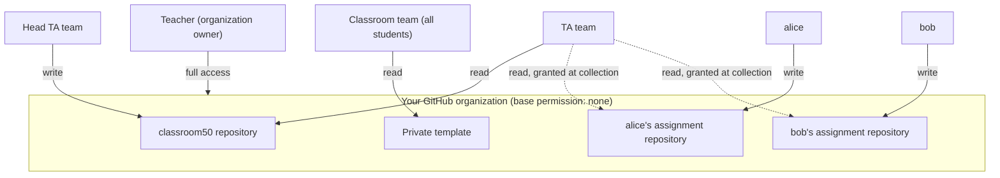

# How Classroom 50 Works

This page describes the model behind Classroom 50: what it is, where its data
is stored, and why teachers remain involved in administration. It also explains
behavior that is otherwise surprising, such as why a student has broad access to
their own repository, or why unenrolling a student does not delete their
repository.

## The mental model: GitHub is the backend

Many web tools have a server and a database: you sign in to their account, and
their systems store your data. Classroom 50 does not work this way.

- The **web app** ([classroom50.org](https://classroom50.org)) is a static site
  hosted on GitHub Pages. It runs in your browser.
- The **CLI** (`gh teacher` and `gh student`) runs on your own machine.

Neither keeps a database of classroom data. The web app stores only a small
amount of local state in your browser (your GitHub access token and interface
preferences such as theme and language), and the CLI reuses the GitHub CLI's
stored credentials. Everything else is stored in GitHub, and your classroom's
state is represented by ordinary GitHub data:

| What you think of as | Is stored as |
| --- | --- |
| Your classrooms, assignments, scores | Configuration files in the private `classroom50` repository in your organization: one directory per classroom holding `classroom.json`, `assignments.json`, `roster.csv`, `scores.json`, and (for group assignments) `teams.json` |
| Who's enrolled | GitHub organization and team membership |
| Who's staff (teacher, head TA, TA) | Membership in `secret` GitHub teams |
| Who's in which group | Membership in per-group GitHub Teams, with a teacher-committed snapshot in `teams.json` |
| An address you invited, before that person joins | A `secret` per-invite team, removed once they're on the roster |
| A student's submissions | Commit history and Releases in their repository |
| Who can do what | GitHub permissions |

Classroom 50 reads and writes this GitHub data on your behalf, then reads it
back to show the current state. Most of the behavior described below follows
from this.

## Why teachers stay involved

Because there is no always-on server, the app does not change state on its own
while you are signed out. It cannot sync state in the background the way a
hosted service can. As a result:

- **Interactive work runs as you.** Creating a classroom, adding a student,
  saving an assignment, or inviting a TA runs at the moment you do it, using
  your signed-in GitHub token. These changes happen only when you make them.
- **Opening a classroom can trigger a sync.** Entering a classroom as an
  organization owner lets the app correct things that have fallen out of date,
  for example recreating a missing classroom team, re-granting staff teams
  their access to the `classroom50` repository, or recording students who
  accepted an email invitation. Some upkeep occurs only after an owner signs in
  and loads the page.
- **Background jobs require setup.** Score collection and regrading run as
  GitHub Actions, but only after you provision the
  [service token](#the-service-token) that lets them act while you are offline.

For teachers, this means administering Classroom 50 is closer to administering
your own GitHub organization than to using a hosted service.

### When state refreshes

Because state lives on GitHub, what you see depends on when something last
read it:

- **Web app.** Loading a page reads the current GitHub state (so opening
  classroom50.org effectively refreshes the roster, teams, and configuration),
  and opening a classroom as an owner can additionally run sync upkeep. One
  exception: the **organization list** is cached for 10 minutes; click
  **Refresh** to force it. If a view looks out of date, reopening the page
  usually updates it.
- **CLI reads** (`roster list`, `classroom list`, `member list`, and so on)
  report what's committed and on GitHub **at that moment**; they never write or
  sync. If the web app shows a newer roster than `roster list` did a
  minute earlier, someone (or a sign-in sync) committed in between.
- **CLI writes** (`roster add`, `staff add`, `assignment add`, and so on)
  update the `classroom50` repository and GitHub teams immediately, but only for
  the thing they change. They don't run the web app's broader sync.
- **Scores** refresh only when collection runs: on demand with
  **Collect now** (one assignment), **Collect all** (a whole classroom), or
  `collect-scores.yaml`.

`gh teacher roster sync <org> <classroom> --write` is the one CLI command that
syncs rather than reading or writing a single thing: it catches the roster up with
the classroom's GitHub state, chiefly the email invitations students have accepted.
Opening the classroom in the web app as an owner does the same on its own. Without
`--write`, `roster sync` reports and changes nothing. **Collect now** and
**Collect all** cover scores.
See [What triggers a sync](#what-triggers-a-sync).

## Interactive and background work

Work happens in one of two ways. Knowing which applies explains most questions
about why a change did or did not take effect:

1. **Interactive actions** run as you, with your signed-in GitHub token, at the
   time you take them (create a classroom, add a student, accept an assignment).
   They are limited by your GitHub permissions and require you to be present.
2. **Asynchronous actions** run in **GitHub Actions workflows** in your
   `classroom50` repository (publishing to Pages, collecting scores,
   regrading). They run in the background, can take a minute or more, and
   depend on the
   [service token](#the-service-token) rather than on you being online.

So when a change hasn't shown up yet, it's usually a background workflow still
running (or GitHub Pages still deploying), not a lost action.

## The web app and CLI are equivalent

The web app and the `gh teacher` and `gh student` CLIs are two front ends over
the same GitHub operations; neither is primary. A classroom created in the web
app is fully manageable from the CLI and the other way around, because both read
and write the same files and teams in your organization. Use whichever you
prefer, or mix them.

## Roles are GitHub organization roles and teams

Classroom 50 has four roles, and each maps directly onto a GitHub construct:

| Role | On GitHub | Can |
| --- | --- | --- |
| **Teacher** | Organization **owner**, on the `-teacher` team | Everything, including organization and classroom settings |
| **Head TA** | Organization **member**, on the `-hta` team | Write the `classroom50` repository; manage the classroom; not an owner |
| **TA** | Organization **member**, on the `-ta` team | Read the `classroom50` repository; view submissions |
| **Student** | Organization **member**, on the classroom team | Accept and submit assignments |

Every classroom has a set of `secret` GitHub teams
(`classroom50-<classroom>-{teacher,hta,ta}` plus the student team
`classroom50-<classroom>`). Membership in these teams *is* the role; there's no
separate role database. That's why staff you invite show up as GitHub team
invitations, and why the classroom's **team is the source of truth for who's
enrolled** (not the `roster.csv`, which carries details GitHub can't store,
such as names, sections, and the address of a student who hasn't joined yet).

### From invitation to enrollment

Enrollment is team membership, and the chain from invitation to enrollment has
three steps:

1. Creating a classroom creates its secret GitHub teams, including the student
   team `classroom50-<classroom>`.
2. Inviting a student through Classroom 50 sends a GitHub organization
   invitation that carries the classroom team.
3. When the student accepts, GitHub adds them to the organization **and** the
   team in one step. Team membership makes them enrolled.

Because the invitation carries the team, inviting a student directly on
github.com bypasses enrollment: they become an organization member but never
join the classroom team. Enroll them from the organization's **Members** page
instead. See
[Already an org member, but not on the roster](Troubleshooting#already-an-org-member-but-not-on-the-roster).

### Invitations by email

Inviting by username records the student on the roster right away, because the
username is the identity. An email address is not: GitHub offers no way to look
up an account from an address, and the person who accepts could sign in with any
account. Classroom 50 bridges that gap with an **invite team**.

1. Inviting an address creates a `secret` team named `invite-<hash>` that holds
   that one address. If this can't be set up, no invitation is sent.
2. GitHub emails the invitation, carrying both the classroom team and the invite
   team.
3. The address is written to `roster.csv` as a **pending row**, with a role but no
   username yet.
4. Accepting adds the student to both teams. Because the invite team holds exactly
   one person, whoever is on it is the student who accepted, so a sync fills their
   account into the pending row and then deletes the invite team. If the invited
   person turns out to be staff on the classroom, the row a sync *creates* for them
   records that staff role rather than `student`.

The web app and the teacher CLI both invite this way, and each reads the other's
invite teams, so an invitation sent from one can be completed or revoked from the
other. In the app, invite from the classroom's **Roster** page; from the CLI, use
`gh teacher roster invite`, one address at a time or a whole list with `--file`.
One thing only the web app does: inviting someone by email as a teacher, head TA,
or TA. A `gh teacher roster invite` is always a student invitation, so it can
never hand out organization ownership from a mistyped address.

An outstanding invitation keeps its team and its pending row, so a teacher can see
who was invited. Canceling one, from the app's roster or with
`gh teacher roster cancel-invite`, deletes its invite team and its pending row
right away; if either write fails, the next sync clears whatever is left. From the
CLI, canceling first proves the invitation belongs to *this* classroom: its
metadata team must name the classroom, and the invitation must carry one of the
classroom's teams. Otherwise `cancel-invite` refuses rather than revoke a sibling
classroom's invitation. A team left by an expired invitation is cleaned up the same
way, once it is more than 24 hours old and GitHub no longer lists the invitation as
pending; a still-pending invitation is never touched.

Inviting an address some other row already carries is allowed, and deliberately
so: an address can be shared (a parent, a lab contact), and the real person still
needs inviting. The invitation is sent, but no second row is written for the
address: one row per address, whichever tool wrote it.

> [!NOTE]
> Invite teams are the one place Classroom 50 stores an address that GitHub
> hasn't yet linked to an account. Each holds only the invited address and the
> classroom name, never names or sections. Because the team is `secret`, no other
> student or TA can see it: before the invitation is accepted the team has no
> members at all, and afterwards only that student and the organization's owners
> can read it. The address on a pending row is the one **you invited**, which is
> not necessarily the email on the student's GitHub account.

### What triggers a sync

Step 4 needs something to run. GitHub doesn't notify Classroom 50 when a student
accepts, so nothing happens while nobody is looking. Four things sync the invite
record, and all of them are idempotent, so running one that has nothing to do is
free.

| Trigger | Where |
| --- | --- |
| Opening the classroom's roster in the web app, or its **Refresh roster** button | The web app, automatic on open and then on demand |
| Entering a classroom as an organization owner | The web app, automatic; it also repairs missing teams |
| **Clean up invite data** | The classroom's **Settings** page, to clear stored addresses early |
| `gh teacher roster sync <org> <classroom> --write` | The CLI, so a script or a scheduled job can run it with no browser |

A sync is deliberately conservative on both sides. If a read is degraded, it
reports and removes nothing: no row is dropped and no invite team is deleted,
because an invite team it couldn't read can't prove that a pending row is dead.
`gh teacher roster sync` reports by default and changes nothing until you pass
`--write`. See [`roster sync`](gh-teacher#roster-sync) for its exit codes.
Deleting a classroom in the web app removes its invite teams too;
`gh teacher classroom remove` leaves them for the next sync or `teardown`.

### Who sees what

The organization lockdown (next section) means nobody sees anything they weren't
explicitly granted. What each role can see:

| | Teacher (owner) | Head TA | TA | Student |
| --- | --- | --- | --- | --- |
| `classroom50` repository (roster, scores, settings) | Read and write | Read and write | Read | No access |
| Private assignment templates | All | Read | Read | Read (their classroom's) |
| Student assignment repositories | All | Read, granted at each collection run | Read, granted at each collection run | Their own only (write) |
| Other students' work | All | After a collection run | After a collection run | Never |
| Pending organization invitations | Yes | No | No | No |



Three consequences worth calling out:

- **Students never see each other's work.** The "No permission" base grants
  nothing by default, and nothing grants one student access to another's
  repository. The deliberate exception is an assignment whose **Repository
  visibility** is public: its repositories are readable by anyone, which is
  the point of a peer-review or showcase assignment.
- **Students can read their classroom's private templates.** The whole
  classroom team gets read access so accept can copy the template. Never
  commit solutions to a template. See
  [Known Limitations](Known-Limitations).
- **Only owners can read pending invitations.** A TA viewing the roster can't
  see who has been invited but hasn't accepted yet, so an invited-but-pending
  student may look missing to them.

## The permission model: why students have broad access to their own repository

The organization is locked down to **least privilege**. During setup, Classroom
50 sets the organization's base permission to **"No permission"** and disables
risky member capabilities (repository deletion, transfer, visibility changes,
and more). This organization-wide lockdown is the safety boundary.

Against that backdrop, each student's access to *their own* assignment
repository is deliberately broad:

- **Individual assignments:** the student creates the repository (which makes
  them its admin), then accept downgrades them to **write**, enough to push work
  but not enough to do damage. An assignment's **Student repository access**
  setting (`--student-permission` in the CLI) can change this default.
- **Group assignments:** members get push access through their group's GitHub
  Team, so no student needs repository admin. The founding accepter's transient
  creator-admin is dropped once the team is attached. See
  [Group assignments are GitHub Teams](#group-assignments-are-github-teams).
- **Legacy group assignments:** the first student to accept (the **founder**)
  keeps **admin** on the shared repository, because they need it to invite
  teammates as collaborators.

This is safe **because of** the organization lockdown: even an admin on their
own repository can't delete it, change its visibility, transfer it, or reach
another student's private repository (the "No permission" base blocks
cross-repository access). The generous per-repository access and the strict
organization policy work together.

> [!NOTE]
> TAs and head TAs get read access to student repositories through the
> score-collection workflow, not at accept time. A newly accepted repository
> therefore has no staff team attached to it, which is expected.

## How student repositories are protected

Setup applies two organization-wide rulesets to every repository in the
organization:

- **`classroom50-protect-submission-history`** targets each repository's
  default branch and blocks force pushes and branch deletion, so a student
  can't rewrite or erase their submission history.
- **`classroom50-feedback-base-lock`** targets the `feedback` branch and blocks
  updates and deletion, keeping the frozen base of the
  [feedback pull request](Autograding-Basics#feedback-pull-requests) in place.

Both rulesets include an organization-admin bypass, so teachers keep full
control. Separately, the `classroom50` repository's default branch has classic
branch protection with force pushes and deletion disabled.

If the setup checks report branch protection as failing and **Fix it** doesn't
resolve it, an enterprise-level policy is usually pinning the setting. The
check is advisory: Classroom 50 works without it. See
[Branch protection "Fix it" does nothing](Troubleshooting#branch-protection-fix-it-does-nothing).

## Why organization settings sometimes change back

If another tool manages the same organization, it and Classroom 50 can disagree
on a setting and flip it back and forth. Before its retirement, GitHub
Classroom was the most common culprit, most notably over private-repository
forking. That tug-of-war shows up in the setup and audit checks as settings that
changed outside Classroom 50.
Classroom 50 no longer enforces the forking setting for this reason; private
templates work either way. If you see a setting you fixed revert later, another
tool (or an organization or enterprise policy) is changing it back.

## How grading flows

1. A student pushes to their repository (with `gh student submit` or a plain
   `git push`).
2. A small workflow in their repository calls the shared **autograde runner** in
   your `classroom50` repository, which fetches the grading logic from Pages and
   runs it.
3. The result is published as a **GitHub Release** on the student's repository.
4. The **score-collection** workflow gathers those results into `scores.json`.

Autograding is optional: an assignment with no tests still tags submissions and
supports feedback. See [Autograding Basics](Autograding-Basics) for the full pipeline.

### The feedback pull request opens at accept, with the diff starting at the baseline

If you enable the feedback pull request, it is opened when the student accepts,
so it is waiting before their first submission, and it exists even when GitHub
Actions is disabled for student repositories. Its base is frozen at the accept
commit, so the setup files (the accept marker and autograde workflow) stay out of
the diff you review. Should accept not manage it, the autograde runner opens the
same pull request on the first submission instead. See
[Feedback pull requests](Autograding-Basics#feedback-pull-requests).

## Lifecycle: enroll, unenroll, and remove are separate

Classroom 50 keeps three actions deliberately distinct, so a small mistake can't
cascade into deleting a student's work:

- **Unenrolling** a student removes them from the classroom's roster and team.
  It does **not** remove them from the organization, and it does **not** delete
  their assignment repositories.
- **Removing** a student from the organization revokes their access to every
  repository in it (and, as a side effect, to their assignment repositories),
  but still doesn't delete the repositories.
- **Deleting** a repository is always a separate, manual action.

## Group assignments are GitHub Teams

A group assignment's groups follow the same derived-state model as everything
else: each group **is** a GitHub Team, named `classroom50-group-<hash>-<n>`
(the hash is derived from the classroom and assignment slugs, `<n>` is the
group's number). The team owns the group's shared repository,
`<classroom>-<assignment>-group-<n>`, and the team's push access to that
repository is the authoritative link between the two. Three consequences:

- **Membership lives on the team.** Members get push access through the team,
  so no student needs repository admin. Grading credits the team's live members
  who are on the classroom roster, never repository collaborators.
- **Who forms the groups is an assignment setting.** With teacher formation,
  the teacher creates the group teams (created `secret`) and a student who
  isn't in one can't accept. With student formation, the first student founds
  the team when accepting and becomes its GitHub team maintainer; those teams
  are created `closed` (visible to organization members) so classmates can
  browse groups and use GitHub's native request-to-join flow. Student-formed
  groups require the organization to allow members to create teams, which
  setup enables by default.
- **A snapshot records intent.** Teacher tooling commits each group's
  intended membership to `<classroom>/teams.json` in the `classroom50`
  repository. GitHub Teams stay authoritative for who can push; the snapshot
  is the baseline the teacher views diff live membership against to surface
  changes, and what makes a deleted group team attributable and recoverable
  afterward.

A group's display name (for example, "The Sharks") is display metadata only,
stored on the team's record: renaming a group never changes its team slug or
its repository name. The legacy group mode predates group teams and still
works the old way: one shared repository owned by the founding student, with
teammates as repository collaborators.

## Assignment repositories

Each accepted assignment produces a repository named in all-lowercase:

```text
<classroom>-<assignment>-<username>
```

A group assignment's shared repository is named
`<classroom>-<assignment>-group-<n>` after its group's number; for a legacy
group assignment, `<username>` is the founder who created the shared repository.
These are normal GitHub repositories, so scripts that automate git operations
against them generally work the same as they did with GitHub Classroom.

GitHub caps a repository name at 100 characters, and a username can be up to
39, so the classroom slug and the assignment slug together can spend at most
59 characters. Classroom 50 enforces this budget wherever a slug is minted:
new classrooms are capped at 40 characters, new assignment slugs must fit the
classroom's remaining budget, and imported slugs that don't fit are shortened
automatically. An older assignment that predates the budget can be fixed once
with a slug rename. See
[Updating an over-budget assignment slug](Web-Teacher-Guide#updating-an-over-budget-assignment-slug)
or [`assignment rename`](gh-teacher#assignment-rename).

> [!NOTE]
> **Private templates need a team grant.** Classroom 50 grants the classroom
> team read access to a private in-organization template every time you save
> the assignment with that template, in the web app or with
> `gh teacher assignment add`. Only an organization owner can grant: when a head
> TA or TA saves, the assignment is written with a warning, and students 404 on
> accept until an owner saves the assignment again. A locked assignment
> deliberately gets no grant until you unlock it. See
> [Template visibility](Assignment-Templates#template-visibility).

## The service token

The **service token** is a fine-grained personal access token stored as a secret
in your `classroom50` repository. The background workflows (score collection,
regrade) use it to read and update student repositories across the
organization, work that runs as the token, not as your interactive session. It's
the same token whether you set it up in the web app or the CLI, and you need
only one per organization. See
[the service-token setup](CLI-Teacher-Guide#create-the-service-token).

## How this differs from GitHub Classroom

| | GitHub Classroom | Classroom 50 |
| --- | --- | --- |
| Backend | Hosted service | None (GitHub repositories and Actions) |
| Classroom and organization | Classrooms managed in the hosted dashboard | A directory in your organization's `classroom50` repository, plus GitHub teams |
| Grading | Hosted autograder | GitHub Actions in each repository |
| Joining | Students self-select their roster entry from an invite link | The owner invites students; accept links work once they've joined the organization |
| Group naming | Team names | Group display names, backed by GitHub Teams (legacy group mode: founder's username) |
| Data | In the service | In your `classroom50` repository (yours to keep) |

For a term-by-term mapping of GitHub Classroom vocabulary (cutoff date,
Download grades, roster identifiers, teams) to Classroom 50's, see
[Coming from GitHub Classroom?](Glossary#coming-from-github-classroom) in the
Glossary.

For a term-by-term reference, see the [Glossary](Glossary); for common questions,
see the [FAQ](FAQ).
